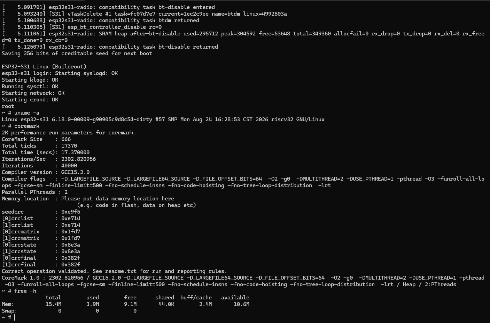

# Flash and First Boot

Build the combined image with `make flash-image`. The image contains SPL,
U-Boot/OpenSBI, base DTB, radio filesystem, XIP kernel, and root filesystem at
the fixed offsets documented in the flash layout. Persistent JFFS2 is omitted
from normal combined images.

Omitting persist data from the merged file does not preserve that flash range
when flashing the whole contiguous binary: its padding still spans the gap.
Use `make flash-all` or the individual slot targets for updates that preserve
existing configuration. Reserve a whole merged-image write for installation
or an explicitly destructive recovery.

Use the parent Makefile's `flash-*` targets so the selected artifact and offset
come from the shared layout configuration. A partial target writes only its
named slot. An operation that erases the entire device or writes the persist
slot must be deliberate because it can remove runtime configuration.

On normal boot, the console shows ROM/SPL, U-Boot, OpenSBI, and Linux handoff,
followed by the root filesystem and init process. A boot stage printing its
banner proves only that control reached that stage; complete boot requires the
Linux init process and expected userspace interfaces.

The parent repository displays the preserved reference image:

